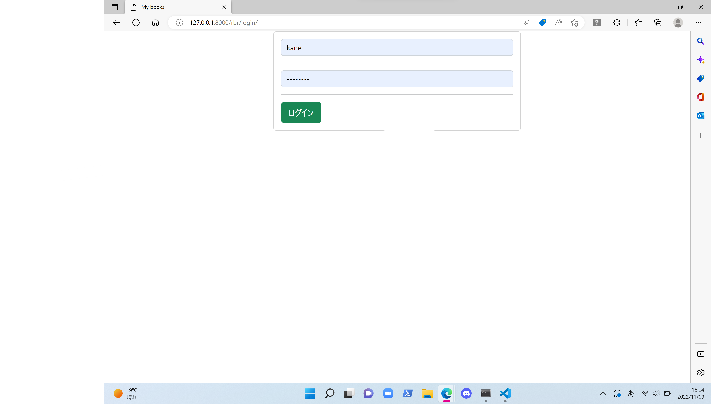
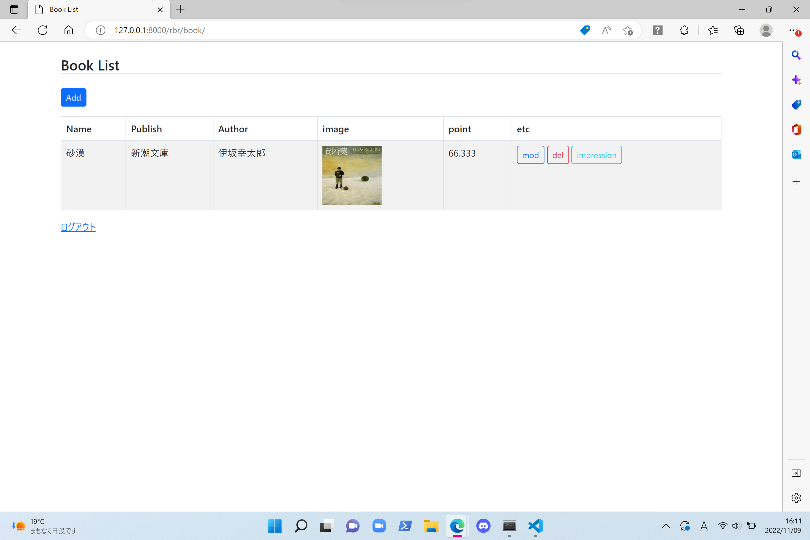
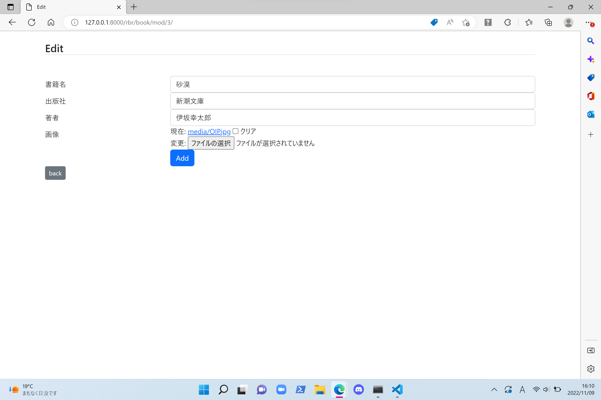
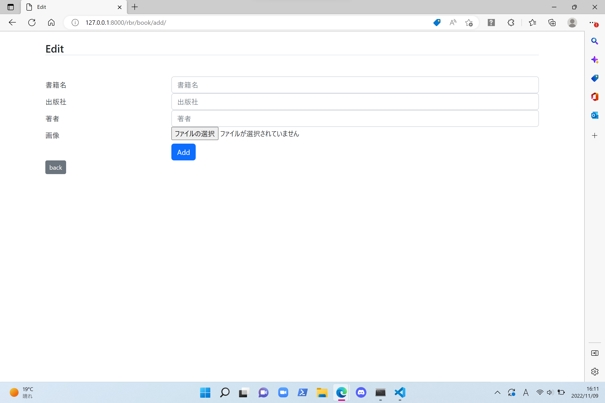

このアプリは
[Python Django入門(1)](https://qiita.com/kaki_k/items/511611cadac1d0c69c54/)
を参考にさせていただきました。

# 書籍管理アプリ

## サーバーの起動
コードが保存してあるディレクトリに移動して

*python manage.py runserber*

## ログイン画面

*http://127.0.0.1:8000/rbr/login/*

管理者権限で登録したユーザでログイン

## 書籍一覧画面

## 追加画面

## 編集画面

### 感想

見よう見真似で少しだけ手を加えて簡単なアプリを作ってみました。公開することはないと思いますが、Djangoの簡単な使い方を学べたので良かったです。
