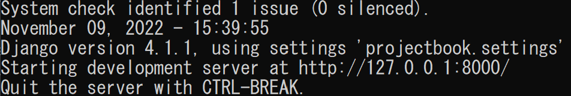

このアプリは
[Python Django入門(1)](https://qiita.com/kaki_k/items/511611cadac1d0c69c54/)
を参考にさせていただきました。

# 書籍管理アプリ

## サーバーの起動
コードが保存してあるディレクトリに移動して

*python manage.py runserber*

## ログイン画面

*http://127.0.0.1:8000/rbr/login/*

管理者権限で登録したユーザでログイン

